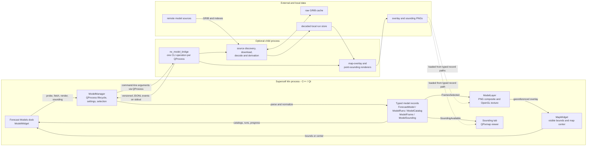

# Forecast model processing architecture

This document describes the current forecast-model integration boundary in
Supercell Wx. The feature is implemented in the C++/Qt application, with model
acquisition and processing delegated to an optional standalone executable. It
does not change the existing radar or alert pipelines.

## Component and process boundaries



`ModelWidget` is the dedicated **View > Forecast Models** dock. It collects a
model, source, run, forecast hours, products, render bounds, and sounding point,
then calls the singleton `ModelManager`. `ModelManager` owns the child-process
lifecycle and converts bridge output into the host-owned types in
`model_types.hpp`: `ForecastModel`, `ModelProbeResult`, `ModelRuns`,
`ModelCatalog`, `ModelFrame`, and `ModelSounding`. The dock and map layer do not
read the helper's store format or model files directly.

The helper owns remote-source details, the raw download cache, decoding and
derived-field work, and the decoded run-store layout. Supercell Wx supplies
application-specific roots for three kinds of local data:

- the decoded run store under the application's local-data `models/store`
  directory;
- the raw GRIB cache under the application's cache `models/grib` directory;
- rendered overlays and soundings under the application's cache
  `models/overlays` directory.

## Host flows

For a map overlay, the dock obtains either the current `MapWidget` bounds or
explicit west/east/south/north bounds. The manager starts `render`; each
successful item becomes a `ModelFrame` containing the PNG path, forecast hour,
dimensions, valid time, and exact geographic bounds. Selecting a forecast hour
emits all matching frames. `ModelLayer` loads those PNGs, composites selected
products with `QPainter`, uploads the result as an OpenGL texture, and draws it
over the frame bounds in the MapLibre map. Opacity, visibility, forecast-hour
selection, playback, and optional main-timeline synchronization remain host
concerns.

For a point sounding, the dock sends a stored run, forecast hour, and either
entered coordinates or the current map center. The helper locates the point on
the stored grid, loads the sounding fields, and renders the complete
`sharppyrs` Skew-T, hodograph, and diagnostics view. The `sounding_complete`
event becomes a `ModelSounding`; the sounding tab loads its PNG and displays
the selected grid location and available metadata. It can also open the image
in a separate resizable fit/actual-size window. A sounding-profile fetch is
required when the map-oriented profile does not contain the needed vertical
fields. Reprocessing the same hour with the sounding profile replaces that
stored hour with the requested field set and reuses cached source files when
they remain available.

## Versioned process protocol

The current schema identifier is `rusty-weather.model-bridge.v1`. Every stdout
line is one JSON object with the envelope:

```json
{"schema":"rusty-weather.model-bridge.v1","event":"...","data":{}}
```

Commands are passed as CLI arguments; JSONL is the event/result channel, not a
linked API. Diagnostic text and fatal errors use stderr. The manager requires a
recognized schema, ignores unknown event names and object members, and turns
known payloads into typed records or Qt signals. The current command/event
surface is:

| Command | Events consumed by Supercell Wx | Host result |
| --- | --- | --- |
| `capabilities` | `capabilities` | model, source, cycle, and product definitions |
| `probe` | `probe_complete` | latest available run and forecast hours |
| `fetch` | `fetch_progress`, `fetch_hour_complete`, `fetch_complete` | progress plus stored run/hour availability |
| `runs` | `runs_complete` | locally stored runs and hours |
| `catalog` | `catalog_complete` | products renderable from a stored hour |
| `render` | `render_started`, `render_item_started`, `render_item_complete`, `render_item_skipped`, `render_item_failed`, `render_complete` | progress and zero or more `ModelFrame` records |
| `sounding` | `sounding_started`, `sounding_complete` | progress and one `ModelSounding` record |
| `cache-status` | `cache_status` | cache byte and file counts |

The helper also currently emits `render_hour_started`; it is intentionally safe
for an older host to ignore that informational event. A nonzero exit or process
crash is reported through stderr/process status rather than a separate JSON
error event.

Only one model operation runs at a time. Cancel first requests graceful process
termination, then kills the child after 1.5 seconds if it has not exited. A
failed start, nonzero exit, or crash clears the manager's busy state and is
reported to the dock. Because processing is in a separate OS process, a decoder
or renderer failure does not execute inside or unwind through the Supercell Wx
process. The ingest implementation uses staged/atomic store paths; cancellation
is still not presented as a transaction or rollback of every cache artifact.

## Build and runtime isolation

This integration adds no Rust source, Rust toolchain step, Rust library, or Rust
ABI to the Supercell Wx build or process. `SCWX_MODEL_BRIDGE_EXECUTABLE` is an
optional CMake file path: when set, CMake copies a prebuilt executable beside
`supercell-wx` and installs it with its license. Nothing from that executable is
added to `target_link_libraries`.

At runtime the manager looks beside the application, on `PATH`, or at the path
chosen in the dock. If no helper is present, model commands report that the
optional processor is unavailable. Radar loading, radar rendering, alerts, and
the rest of the application continue through their existing C++ paths and do
not depend on the model helper.

## Raster extent behavior

The default render mode is deliberately viewport-bounded. Clicking render
captures the visible map bounds at that moment and requests a single
georeferenced raster for that rectangle. Panning or zooming out beyond it does
not reveal more model data, because `ModelLayer` correctly draws the texture
only over the bounds recorded in `ModelFrame`; rendering again captures the new
view.

For a broad or full-domain image, the user can clear **Use current viewport
bounds** and enter explicit bounds. This is an explicit-bounds path, not
automatic discovery of the model's native domain. The current renderer produces
one image per product/hour, preserves the Web-Mercator aspect ratio, and caps
either image dimension at 4096 pixels. A large domain therefore trades spatial
detail for coverage.

A future tiled renderer could request or cache georeferenced tiles as the map
moves, avoiding manual rerenders and keeping individual textures bounded. That
would require a tile or manifest record and corresponding `ModelLayer` support;
the current implementation is a single-raster overlay and does not provide
automatic tiling.

## Replacement and extension points

The stable seam for the host UI is the typed record/signal boundary, not the
Rust implementation or its on-disk store. A built-in C++ provider could perform
discovery, acquisition, storage, rendering, and sounding generation and then
produce the same records. Likewise, a future plugin system could supply a model
provider behind that boundary. The current code does not yet define a provider
interface or plugin ABI: `ModelManager` directly implements the QProcess/JSONL
adapter, so formalizing that interface would be the first refactor. The dock,
timeline behavior, and `ModelLayer` need not depend on which provider produces
the typed results.

The current ProductDatastore work in PR #643 is not that generic provider
boundary. Its public API and storage are specifically expressed in terms of
`RadarProductRecord`, `NexradFile`, and NEXRAD Level 2/Level 3 lookup and cache
semantics. Forecast-model runs contain multi-field grids, profiles, derived
products, and rendered artifacts, so this integration does not route them
through that radar datastore. If ProductDatastore is generalized later around
provider-neutral records or artifacts, a model provider could adapt to it
behind `ModelManager` without exposing those storage details to the dock or map
layer.
